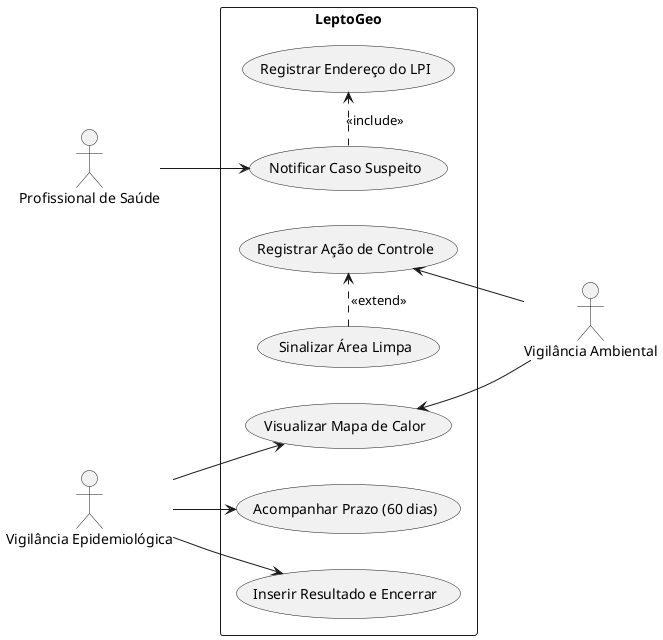

# Sistema de Monitoramento e Assistência ao combate à Leptospirose

**Autores:** Guilherme Rocha Sampaio e Lucas Gabriel Veloso de Souza

---

## Descrição Sucinta da Doença

A leptospirose é uma doença infecciosa febril de início abrupto, cujo espectro clínico pode variar desde infecções inaparentes até formas graves e fulminantes. O agente etiológico causador é a bactéria do gênero *Leptospira*.

A infecção humana ocorre de forma acidental, resultante da exposição direta ou indireta à urina de animais infectados (principalmente roedores como o *Rattus norvegicus* e *Rattus rattus*), geralmente por meio de água ou solo 
contaminados durante enchentes ou alagamentos. O período de incubação da doença varia de 1 a 30 dias.

---

## Apresentação da Parte Problemática

A vigilância epidemiológica da leptospirose exige a identificação rápida do Local Provável de Infecção (LPI) para o desencadeamento de ações de controle, como a desratização. Além disso, administrativamente, o caso notificado 
precisa ser encerrado no sistema em até 60 dias após a notificação inicial.

**O problema:** Atualmente, há uma lacuna e lentidão na comunicação entre o atendimento clínico (que recebe o paciente e faz a notificação) e a Vigilância Ambiental (responsável por atuar no território). O atraso na consolidação 
espacial e temporal dos dados impede o mapeamento ágil de áreas de risco, retardando o alerta a populações vulneráveis e as ações de saneamento.

---

## Apresentação da Solução Proposta

O sistema proposto é o LeptoGeo, uma plataforma web e mobile focada na integração em tempo real entre a assistência clínica e a vigilância ambiental.

Sempre que um profissional de saúde preencher os dados de suspeita e o endereço do LPI, o sistema automaticamente vai plotar um "alerta vermelho" em um mapa de calor compartilhado com a equipe de Zoonoses/Vigilância Ambiental. O 
sistema também possuirá um painel de controle (Kanban) que fará a contagem regressiva do prazo de 60 dias para o encerramento do caso, enviando lembretes automatizados à Vigilância Epidemiológica para solicitar os resultados dos 
exames de laboratório.

---

## Documento de Requisitos

### Requisitos Funcionais (RF)

* **RF01:** O sistema deve permitir o cadastro de um caso suspeito de Leptospirose, coletando os dados clínicos primários e o endereço do Local Provável de Infecção (LPI).
* **RF02:** O sistema deve gerar um mapa de calor georreferenciado, atualizado em tempo real, evidenciando as áreas com maior incidência de notificações.
* **RF03:** O sistema deve disparar um alerta automático (notificação push/email) para a equipe de Vigilância Ambiental sempre que um novo LPI for registrado.
* **RF04:** O sistema deve ter um painel de prazos que contabilize o limite de 60 dias para o encerramento da ficha epidemiológica, sinalizando casos atrasados.
* **RF05:** O sistema deve permitir que a Vigilância Ambiental registre o status da ação de controle executada no território (ex: desratização, limpeza, ação educativa).

### Requisitos Não Funcionais (RNF)

* **RNF01:** O sistema deve ser responsivo, permitindo acesso via desktop (hospitais) e tablets/smartphones (agentes em campo).
* **RNF02:** O sistema deve estar em conformidade com a Lei Geral de Proteção de Dados (LGPD), anonimizando a identidade do paciente no mapa visualizado pela equipe de campo (mostrando apenas o raio geográfico do LPI).

---

## Diagrama de Caso de Uso

Abaixo está o código PlantUML estruturado com os atores e casos de uso definidos. As marcações `<<include>>` e `<<extend>>` utilizam notas nas ligações para melhor legibilidade.



---

## Arquitetura da Informação e Protótipos de Baixa Fidelidade

A Arquitetura da Informação será dividida em três fluxos principais baseados no perfil de acesso. **Navegação Principal:** Dashboard (Mapa/Métricas) > Notificar Novo Caso > Gestão de Prazos > Relatórios.

### Tela 1: Dashboard Integrado (Visão Geral)
A tela de entrada para gestores e vigilância ambiental, focada em análise espacial.

```text
┌────────────────────────────────────────────────────────────────────────┐
│ LeptoGeo      [ Dashboard ]  [ Notificar ]  [ Prazos ]  [ Relatórios ] │
├────────────────────────────────────────────────────────────────────────┤
│                                                                        │
│  Casos Suspeitos: 12                                                   │
│  Casos Confirm.: 4                                                     │
│  Prazos Vencendo: 1                                                    │
│                                                                        │
│  ┌──────────────────────────────────────────────────────────────────┐  │
│  │                     MAPA INTERATIVO DA CIDADE                    │  │
│  │                                                                  │  │
│  │   ( ! ) Ponto Vermelho (LPI c/ ação pendente)                    │  │
│  │   ( v ) Ponto Verde (LPI c/ ação concluída)                      │  │
│  │                                                                  │  │
│  └──────────────────────────────────────────────────────────────────┘  │
│                                                                        │
└────────────────────────────────────────────────────────────────────────┘
```

### Tela 2: Formulário de Notificação e LPI
A tela usada pelo médico/enfermeiro ao atender o paciente.

```text
┌────────────────────────────────────────────────────────────────────────┐
│ NOVA NOTIFICAÇÃO - LEPTOSPIROSE                                        │
├────────────────────────────────────────────────────────────────────────┤
│                                                                        │
│ 1. Dados do Paciente                                                   │
│ Nome Completo: ______________________________________________________  │
│ Cartão SUS: _________________________  Data Nasc.: ____/____/______  │
│                                                                        │
│ 2. Local Provável de Infecção (LPI)                                    │
│ CEP: _________________                                                 │
│ Rua: ________________________________________________________________  │
│                                                                        │
│                                                                        │
│                     [ CANCELAR ]            [ SALVAR E ENVIAR ]        │
└────────────────────────────────────────────────────────────────────────┘
```

### Tela 3: Gestão de Prazos (Visão da Vigilância Epidemiológica)
Tela focada em evitar o vencimento do prazo para encerramento dos casos.

```text
┌────────────────────────────────────────────────────────────────────────┐
│ ACOMPANHAMENTO DE CASOS (Limite: 60 dias)                              │
├─────────────┬─────────────┬────────────────┬──────────────────┬────────┤
│ PACIENTE    │ DATA NOTIF. │ DIAS RESTANTES │ STATUS LAB.      │ AÇÃO   │
├─────────────┼─────────────┼────────────────┼──────────────────┼────────┤
│ João M.     │ 10/05       │ 06 Dias        │ Aguardando Elisa │ [ >> ] │
│             │             │                │                  │        │
└─────────────┴─────────────┴────────────────┴──────────────────┴────────┘
```

